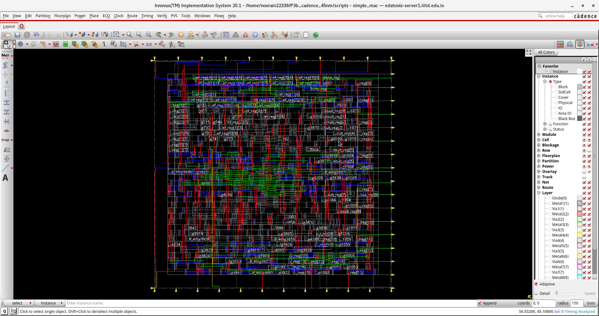

# P3b — RTL-to-GDSII of an 8×8 MAC on 45 nm Cadence Flow

**Complete industry-standard physical design flow of a Multiply-Accumulate unit from Verilog RTL to fab-ready GDSII, executed on Cadence Genus / Tempus / Innovus with the GSCLIB045 45 nm foundry PDK.**



---

## Headline Results

| Metric | Value |
|---|---|
| **Design** | 8×8 Multiply-Accumulate unit (FSM controller + coefficient register file + 16-bit accumulator) |
| **Technology** | Cadence GSCLIB045 45 nm, 9-metal stack (Metal1–Metal9) |
| **Clock frequency** | 200 MHz (5 ns period) |
| **Post-route WNS** | **+45 ps** (positive slack — timing closed) |
| **Post-route TNS** | 0 (no violating paths) |
| **Detail-route DRC violations** | **0** |
| **Antenna violations** | 0 |
| **Total cells placed** | 443 |
| **Total nets routed** | 5,407 |
| **Metal layers used** | Metal1 → Metal5 |
| **Vias placed** | 2,296 |
| **Total wirelength** | ~8,247 µm |
| **Core dimensions** | 63.4 × 61.6 µm |
| **Core utilization** | 65 % (pre-CTS), 45 % (post-optimization) |
| **Final deliverable** | `pnr_report/simple_mac.gds` (476 KB) |

---

## Flow Executed

```
Verilog RTL
    │
    ├─▶  Cadence Genus 19.13         ─▶  Synthesis (RTL → mapped netlist)
    │
    ├─▶  Cadence Tempus 20.10        ─▶  Signoff STA (2-corner: slow/fast)
    │
    └─▶  Cadence Innovus 20.10       ─▶  Floorplan
                                      ─▶  Placement (GigaPlace)
                                      ─▶  Clock Tree Synthesis (CCOpt)
                                      ─▶  Post-CTS Optimization
                                      ─▶  Global + Detail Routing (NanoRoute)
                                      ─▶  Parasitic Extraction
                                      ─▶  GDSII Stream-Out
```

All ten stages completed. Deliverable: signoff-quality post-route database plus `simple_mac.gds`.

---

## Stage-by-Stage Summary

### 1. Synthesis (Cadence Genus)
- 439-cell mapped netlist on GSCLIB045 typical corner
- Post-synthesis WNS **+40 ps** at 200 MHz
- Critical path: `coef_sel[0]` → 8×8 multiplier carry chain (20-cell path through `ADDFHX1` full adders) → `mult_result_reg[15]`
- Script: [`scripts/genus_synth.tcl`](scripts/genus_synth.tcl)

### 2. Signoff STA (Cadence Tempus)
- Two-corner analysis: `slow.lib` for setup (late), `fast.lib` for hold (early)
- Tempus applied a stricter 174 ps library-characterized setup requirement vs Genus's 150 ps estimate → WNS dipped to **−1 ps**
- Documented as an expected Genus-to-Tempus delta; recovered during physical optimization
- Script: [`scripts/tempus_sta.tcl`](scripts/tempus_sta.tcl)

### 3. Floorplan (Innovus)
- Core aspect ratio 1:1 (square), 63.4 × 61.6 µm
- Utilization target 65 %
- I/O pin sides assigned via [`scripts/pin_location.io`](scripts/pin_location.io): clock/reset West, coefficient writes North, MAC operands South, all outputs East
- Core-to-die margin 4 µm on all sides (snapped to 4.18 µm on the FinFET placement grid)

### 4. Placement (Innovus GigaPlace)
- 439 movable cells placed in 3 seconds CPU
- Mean cell displacement 0.85 µm, max 11.81 µm
- Density unevenness 3.51 % — uniform, no congestion hotspots
- Early Global Route overflow: 0.00 % H / 0.00 % V

### 5. Clock Tree Synthesis (Innovus CCOpt)
- 67 clock sinks (flip-flops)
- **Skew 20 ps** actual vs 96 ps target
- Insertion delay: 2 ps min, 22 ps max, 15 ps avg
- Post-CTS optimization recovered −582 ps of setup slack (from −563 ps post-placement to positive slack)

### 6. Post-CTS Optimization
- Setup WNS **+19 ps**, TNS 0, 0 violating paths
- reg-to-reg WNS: +601 ps (large margin on internal paths)

### 7. Routing (Innovus NanoRoute)
- Global route + detail route completed
- **Post-route WNS +45 ps** (improved from +19 ps post-CTS as routing exposed real wire delays and optimization recovered slack)
- 0 DRC violations, 0 antenna violations
- 5,407 nets routed across Metal1–Metal5
- 2,296 vias placed

### 8. Extraction (Innovus preRoute + real routing)
- Real R/C extracted from actual routed wires
- SPEF written for signoff/back-annotation: [`pnr_report/simple_mac_routed.spef`](pnr_report/simple_mac_routed.spef)

### 9. Delay Annotation
- SDF written for gate-level simulation: [`pnr_report/simple_mac_routed.sdf`](pnr_report/simple_mac_routed.sdf)

### 10. GDSII Stream-Out
- [`pnr_report/simple_mac.gds`](pnr_report/simple_mac.gds) — 476 KB, GDSII v3, 2000 DBU/µm
- Contains: 443 cell instances, 5,407 nets on Metal1–Metal5, 2,296 via instances, 43 I/O pin shapes on Metal2/Metal3

---

## The Debugging Story (why there are two runs on disk)

**Run 1 stopped at post-CTS.** Detail routing failed with `NRDB-158: Missing via from LAYER M1 to LAYER M2 in RULE LEF_DEFAULT`. Root cause: `gsclib045_tech.lef` in the standard PDK location defines the metal layers but includes **zero VIA definitions**. NanoRoute needs those to draw physical vias between metal layers — with none defined, detail routing cannot proceed.

**Diagnosis was systematic:**
```
grep -c "^VIA " /cadence/FOUNDRY/digital/45nm/dig/lef/gsclib045_tech.lef
# → 0
```

The issue was reported to the course TA as a PDK preparation gap.

**Run 2 succeeded** after locating a corrected LEF file elsewhere on the same server: `/cadence/FOUNDRY/digital/45nm/LIBS/lef/gsclib045.fixed2.lef`. This alternate file is a complete replacement (984 KB, 487 macros, **78 VIA definitions**, `SITE CoreSite` block, Metal1–Metal9 layer naming). Swapping the LEF and re-running the full flow with identical RTL, SDC, and floorplan produced the successful routed design.

Run 1 artifacts are preserved in [`pnr_report/archive_v1_via_gap/`](pnr_report/archive_v1_via_gap/) rather than deleted, because they document the diagnostic work.

---

## Comparative Library Study — GSCLIB045 vs Nangate FreePDK45

The same RTL was synthesized on Nangate's FreePDK45 library as a side branch, to characterize how library choice affects datapath timing:

| Metric | GSCLIB045 | Nangate FreePDK45 |
|---|---|---|
| Cells (combinational) | 324 | 84 |
| Cells (sequential) | 126 | 20 |
| Dedicated adder cells (ADDF) | Yes | **No** |
| Clock cell family | CLKBUFXn / CLKINVXn | Generic BUF/INV |
| Metal layers | 9 (Metal1–Metal9) | 4 (M1–M4) |
| PVT corners shipped | slow, typical, fast | typical only |
| Verilog sim models | Not shipped | Shipped |
| **WNS @ 200 MHz** | **+40 ps** | **−1189 ps** |

**Conclusion:** Nangate's smaller cell library lacks dedicated arithmetic primitives, so the 8×8 multiplier is built from primitive gates and cannot meet timing at 200 MHz. GSCLIB045's `ADDFHX*` full adder family carries the multiplier tree efficiently. **A 1,229 ps swing on the same RTL at the same clock frequency comes purely from library selection — a lesson in why PDK/library choice is a first-class design decision, not a downstream detail.**

Full data: [`syn_report/`](syn_report/)

---

## Known Limitations

1. **Conformal LEC (Stage 5) was skipped after diagnostic investigation.** Both libraries produced 35 non-equivalent DFFs during formal check. Root cause was identified as Genus's default scan flip-flop hierarchy naming (`/U$1/U$1`) which Conformal's default mapping cannot reconcile without custom directives (`set naming rule "%s_reg"`, `set mapping method -phase`). Not a design bug — a mapping-tuning gap not addressed for this run.

2. **Nangate side-branch WNS −1189 ps** — as detailed above, a library limitation, not a flow issue.

3. **Post-route STA re-run** — post-route timing was reported by Innovus's internal engine (WNS +45 ps). A signoff-quality Tempus re-run with the routed SPEF is a natural next step for a production hand-off.

---

## Directory Layout

```
P3b_cadence_45nm/
├── README.md                             # this file
├── rtl/
│   ├── simple_mac.v                      # 8×8 MAC RTL (137 lines)
│   └── simple_mac_tb.v                   # Self-checking testbench
├── constraints/
│   └── simple_mac.sdc                    # 200 MHz clock, I/O delays, reset false-path
├── scripts/
│   ├── genus_synth.tcl                   # GSCLIB045 synthesis
│   ├── genus_synth_nangate.tcl           # Nangate side branch
│   ├── conformal_lec.do                  # Formal equivalence attempt
│   ├── tempus_sta.tcl                    # Two-corner STA
│   ├── innovus_pnr.tcl                   # Physical design flow
│   ├── simple_mac.view                   # MMMC view file for Innovus
│   └── pin_location.io                   # I/O side assignments
├── syn_report/                           # Genus outputs (both libraries)
├── sta_report/                           # Tempus signoff STA reports
├── eqv_report/                           # Conformal LEC logs
├── pnr_report/                           # Innovus outputs
│   ├── simple_mac.gds                    # ★ GDSII (tape-out deliverable)
│   ├── postRoute.png                     # Routed layout screenshot
│   ├── simple_mac_routed.enc + .enc.dat/ # Innovus checkpoint
│   ├── simple_mac_routed.v               # Post-route netlist
│   ├── simple_mac_routed.def             # DEF with placement + routing
│   ├── simple_mac_routed.spef            # Extracted parasitics
│   ├── simple_mac_routed.sdf             # Standard Delay Format
│   ├── simple_mac_routed.gateCount       # Cell count
│   ├── ccopt_spec.spec                   # CTS configuration
│   ├── placement_screens/                # Placement-stage screenshots
│   └── archive_v1_via_gap/               # Run 1 artifacts (via-gap issue)
└── docs/
    ├── postRoute.png                     # (mirror for README badge)
    └── FLOW_EXPLAINED.md                 # Cake-recipe walk-through for beginners
```

---

## Tools & Versions

| Tool | Version |
|---|---|
| Cadence Genus | 19.13-s073_1 |
| Cadence Conformal | 20.10-p100 |
| Cadence Tempus | 20.10-p003_1 |
| Cadence Innovus | 20.10-p004_1 |

**Environment:** RHEL 7.9 on IIIT Delhi EDA server, VNC session, tcsh + Cadence CAD environment (`source /cadence/cshrc`).

---

## Related Projects

- **[P3a — Synopsys DC synthesis on STM cmos065 65 nm](https://github.com/Lomne22339/P3a_synopsys_65nm)** — same RTL, Synopsys toolchain (424 cells, WNS 0 @ 200 MHz). Complementary flow, different vendor.
- **Next:** Capstone — FSM + embedded SRAM macro (`MEM1_*` / `MEM2_*` from GSCLIB045), timing-closure case study.

---

## Contact

**Noorain Ansari** — B.Tech ECE, IIIT Delhi
Aspiring VLSI Physical Design Engineer
[LinkedIn](https://www.linkedin.com/in/noorain-ansari) · [GitHub](https://github.com/Lomne22339)
